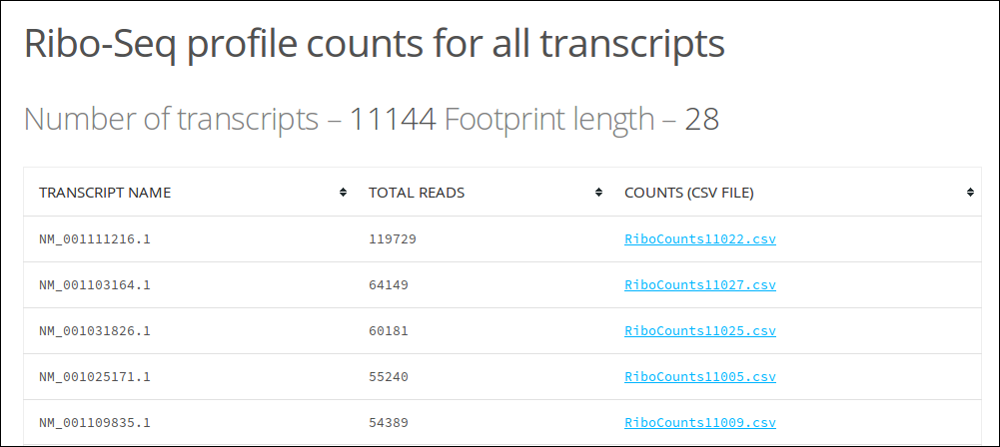

RiboCount
=========
Output read counts for all transcripts in an alignment.

Parameters
----------
1. Ribo-Seq alignment file (Sorted BAM file)
............................................
A Bowtie 1 output (BAM) from an alignment of Ribo-Seq data to the transcriptome. This BAM
file should be sorted. This can be done using one of the following methods.

1. RiboGalaxy_ -> Sort Data -> Sort BAM dataset.
2. ``samtools sort input.bam inputsorted``

2. Transcriptome (FASTA)
........................
A FASTA format file with sequences of the transcripts.

3. Read lengths to consider [optional] (Integer - 0 or greater)
...............................................................
If this option is provided, only Ribo-Seq data of the given length is considered.

4. Offset [optional] (Integer - 0 or greater)
.............................................
If this option is provided, this offset is added to the read alignment positions.

5. Restrict read counts
.......................
Choose whether to output read counts for the entire transcript or restrict read counts to the 5' or 3' region of the longest ORF.
Default start (ATG) and stop codons ('TAG', 'TGA', 'TAA') are used to identify the longest ORF in 3 frames.

Output
------
Read counts for all transcripts in the alignment (ZIP)
......................................................
The output file ``ribocount_output.zip`` should first be uncompressed. This will generate
a folder called ``ribocount_output``. Open ``index.html`` in a web browser to view the results of ribocount.

Total reads for each transcript will be displayed in a table along with the name of the transcript and a link
to the CSV file containing the read counts in 3 frames for each position in the transcript. If 5' or 3' counts
are requested, an extra column will be present with reads in these regions.

Command line
------------
``ribocount`` can also be run on the command line. The usage is ::

    ribocount [-h] -b RIBO_FILE -f TRANSCRIPTOME_FASTA [-l INTEGER]
                    [-s INTEGER] [-v | -r] [-m HTML_FILE] [-o OUTPUT_PATH]
                    [-d]

    Output read counts for all transcripts

**required arguments**:
    -b RIBO_FILE, --ribo_file RIBO_FILE
        Ribo-Seq alignment file in BAM format
    -f TRANSCRIPTOME_FASTA, --transcriptome_fasta TRANSCRIPTOME_FASTA
        FASTA format file of the transcriptome

**optional arguments**:
    -h, --help            show this help message and exit
    -l INTEGER, --read_length INTEGER
        Read length to consider (default: None)
    -s INTEGER, --read_offset INTEGER
        Read offset (default: 0)
    -v, --count_five      Flag. Output reads in 5' region
    -r, --count_three     Flag. Output reads in 3' region
    -m HTML_FILE, --html_file HTML_FILE
        Output file for results (HTML)
    -o OUTPUT_PATH, --output_path OUTPUT_PATH
        Files are saved in this directory
    -d, --debug           Flag. Produce debug output

.. links

.. _RiboGalaxy: http://ribogalaxy.ucc.ie
