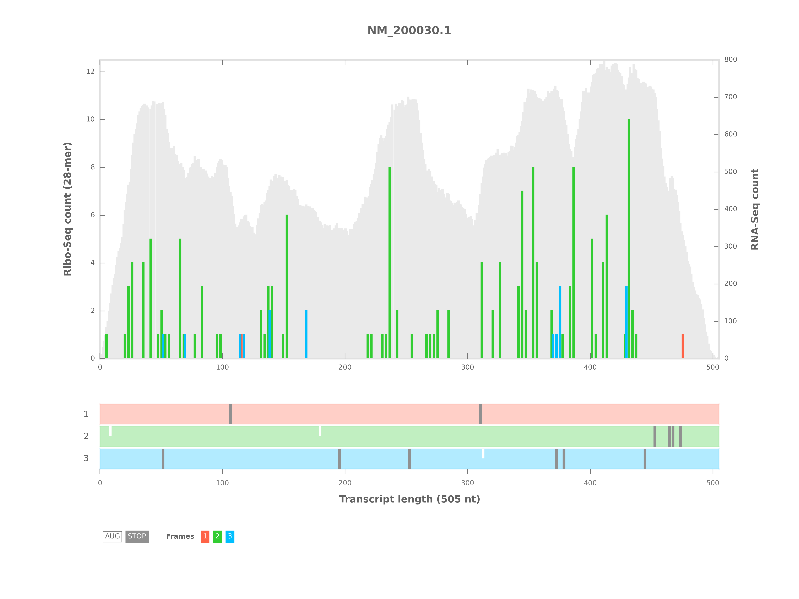
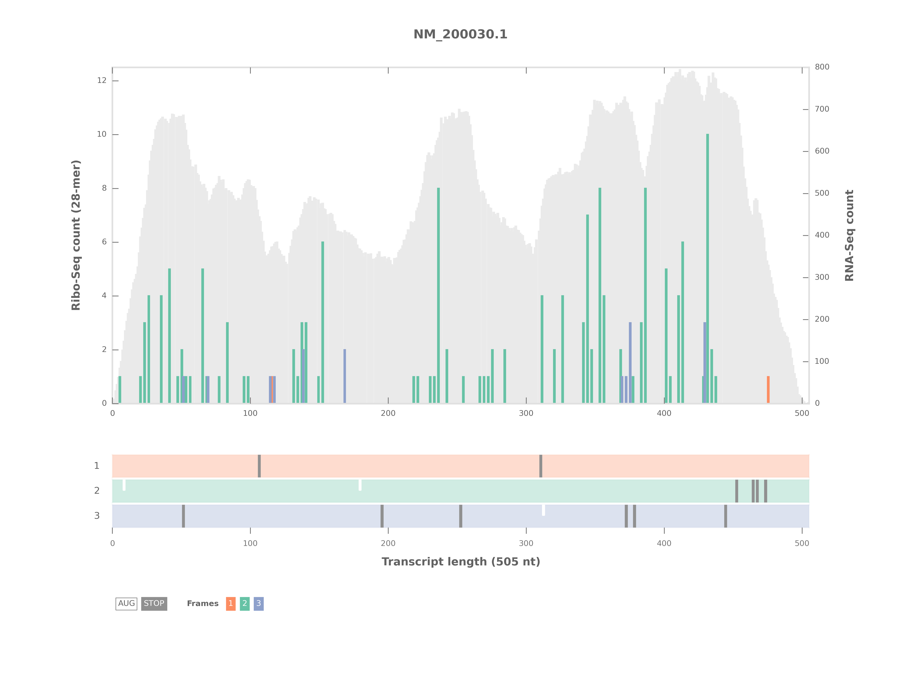
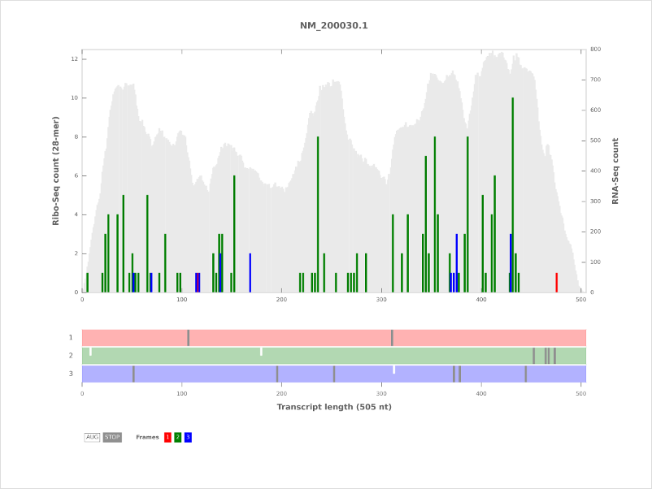
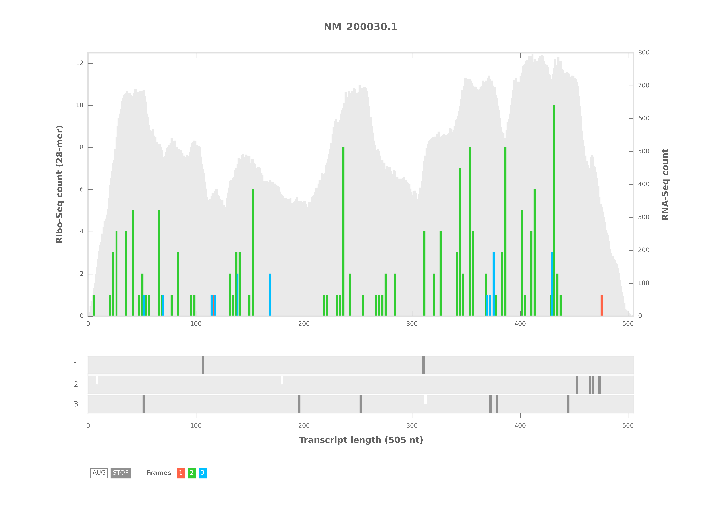

RiboPlot
========
Plot and output Ribo-Seq read counts of a single transcript from an alignment file (sorted BAM).

Parameters
----------

1. Ribo-Seq alignment file (Sorted BAM file)
............................................
A Bowtie 1 output (BAM) from an alignment of Ribo-Seq data to the transcriptome. This BAM
file should be sorted. This can be done using one of the following methods.

1. RiboGalaxy_ -> Sort Data -> Sort BAM dataset.
2. ``samtools sort input.bam inputsorted``

2. Transcriptome (FASTA)
........................
A FASTA format file with sequences of the transcripts.

3. Name of the transcript to plot (Text)
........................................
The name of the transcript to plot **should** match the name in the transcriptome (FASTA)
and the Ribo-Seq/RNA-Seq alignment (BAM).

4. RNA coverage [optional] (Sorted BAM file)
............................................
If you have RNA-Seq data (sorted BAM), you can select the option to plot RNA coverage.

5. Read lengths to consider [optional] (Integer - 0 or greater)
...............................................................
If this option is provided, only Ribo-Seq data of the given length is considered.

6. Offset [optional] (Integer - 0 or greater)
.............................................
If this option is provided, this offset is added to the read alignment positions.

Output
------
1. Plots (PNG and SVG)
......................
Ribo-Seq read counts as a bar plot in 3 frames (color codes: 1: red, 2: green, 3: blue)

RNA coverage as a gray background (if the RNA coverage option was selected).

The open reading frame architecture appears below the plot with start (ATG) and stop codons ('TAA', 'TAG', 'TGA') in all 3 frames.

The color codes are start (white) and stop (dark gray).

2. RiboSeq read counts (CSV)
............................
In 3 frames for each position in the transcript.

Additional color schemes
------------------------
Three additional color schemes are available in addition to the default used in the plot above. 

ColorBrewer
...........
Uses a color blind and print friendly color scheme from `ColorBrewer <http://colorbrewer2.org/>`_.

To use this color scheme, use the ``-c colorbrewer`` option with ``riboplot``.

RGB
...
Uses the default red, blue and green colors.

To use this color scheme, use the ``-c rgb`` option.

GreyORFs
........
Uses the default color scheme but the ORF architecture is displayed in a grey background.

To use this color scheme, use the ``-c greyorfs`` option.

Command line
------------
``riboplot`` can also be run on the command line. The usage is ::

    riboplot [-h] -b RIBO_FILE -f TRANSCRIPTOME_FASTA -t TEXT
             [-n RNA_FILE] [-l INTEGER] [-s INTEGER] 
             [-c {default,colorbrewer,rgb,greyorfs}] [-m HTML_FILE]
             [-o OUTPUT_PATH] [-d]

Plot and output read counts for a single transcript

**required arguments**:
    -b RIBO_FILE, --ribo_file RIBO_FILE
        Ribo-Seq alignment file in BAM format
    -f TRANSCRIPTOME_FASTA, --transcriptome_fasta TRANSCRIPTOME_FASTA
        FASTA format file of the transcriptome
    -t TEXT, --transcript_name TEXT
        Transcript name

**optional arguments**:
    -h, --help  show this help message and exit
    -n RNA_FILE, --rna_file RNA_FILE
        RNA-Seq alignment file (BAM)
    -l INTEGER, --read_length INTEGER
        Read length to consider (default: None)
    -s INTEGER, --read_offset INTEGER
        Read offset (default: 0)
    -c COLOR_SCHEME, --color_scheme COLOR_SCHEME                
         Color scheme to use (default: default). Other options are colorbrewer, rgb, greyorfs
    -m HTML_FILE, --html_file HTML_FILE
        Output file for results (HTML)
    -o OUTPUT_PATH, --output_path OUTPUT_PATH
        Files are saved in this directory
    -d, --debug
        Flag. Produce debug output

.. links

.. _RiboGalaxy: http://ribogalaxy.ucc.ie
